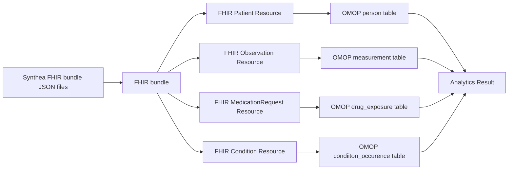

# Synthea FHIR dataset pipeline

This project consists of Databricks notebooks that ingests, processes and aggregate Synthetic FHIR data generated by Synthea.<br/>
The dataset used is publically available as **Childhood Obesity - Synthetic Denver, FHIR** on [this page](https://synthea.mitre.org/downloads) 

---

## Architecture Overview



## Data Format Conversion Flow

- **FHIR Bundle**<br/>
    A set of FHIR resources gathered into a JSON object
  ```json
  {
      "resourceType": "Bundle",
      "type": "transaction",
      "entry": [
          {"resourceType": "Patient", ...},
          {"resourceType": "Observation", ...},
          ... more resources
      ]
  }
  ```

- **FHIR Resource**<br/>
    A deeply nested object. One resource has one resourceType.
  ```json
  {
      "resourceType": "Observation",
      "subject": { "reference": "Patient/1234" },
      "code": {
          "coding": [{ "system": "http://loinc.org", "code": "39156-5" }] 
      },
      "valueQuantity": { "value": 30, "unit": "kg/m2" },
      ... more properties
  }
  ```

- **OMOP Table** <br/>
    Flat table data structure suitable for querying
  ```sql
  -- Measurement Table
  measurement_id           string
  person_id                string
  measurement_concept_id   string
  value_as_number          float
  ...                      ...
  ```

- **Analytics** <br/>
  Target survey:<br/>
    **Does early antibiotic exposure vs no exposure during infancy increase the risk of childhood obesity?<br/>**
  [SQL](https://github.com/kenichsberg/synthea-fhir-to-omop-pipeline/blob/main/notebooks/4.omop_to_result.ipynb)
  
